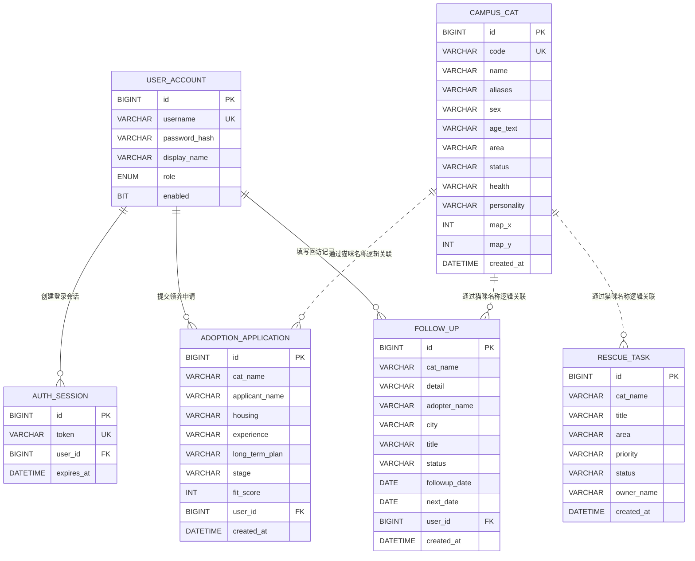

# “猫伴校园”平台数据库表设计说明书

## 1. 文档信息

| 项目 | 内容 |
|---|---|
| 项目名称 | “猫伴校园”——校内猫咪救助、健康记录与可信领养平台 |
| 数据库名称 | `catmate` |
| 数据库管理系统 | MySQL 8.0 |
| 存储引擎 | InnoDB |
| 默认字符集 | `utf8mb4` |
| 默认排序规则 | `utf8mb4_0900_ai_ci` |
| 后端持久层 | Spring Data JPA / Hibernate |
| 文档版本 | V1.0 |

## 2. 数据库设计目标

本数据库用于保存校内猫咪档案、异常救助任务、领养申请、毕业生领养后的回访记录以及平台登录信息，主要设计目标如下：

1. 为每只已建档猫咪建立唯一、可持续维护的校园身份档案。
2. 记录校内猫咪异常情况和救助任务的处理过程。
3. 保存普通用户提交的领养申请，并支持管理员统一查看和审核。
4. 记录猫咪被在校生或毕业生领养后的长期回访信息。
5. 只设置普通用户和管理员两种角色，满足当前课程项目的权限要求。
6. 使用独立登录会话表实现登录鉴权，避免在业务接口中直接传递账号密码。
7. 使用 `utf8mb4` 保存中文、英文及特殊符号，防止猫咪昵称、地点和描述出现乱码。

## 3. 命名与字段约定

- 数据库名、表名和字段名统一使用小写蛇形命名法，例如 `user_account`、`created_at`。
- 所有主键统一命名为 `id`，类型为 `BIGINT`，由数据库自增生成。
- 时间点使用 `DATETIME(6)`，日期使用 `DATE`。
- Java 实体中的驼峰字段由 Hibernate 映射为蛇形字段，例如 `displayName` 映射为 `display_name`。
- 密码只保存加盐哈希结果，不保存明文。
- 业务状态当前使用中文值，便于课程演示；固定权限角色使用英文枚举值。

## 4. 数据库总体结构

当前数据库共包含 6 张表：

| 序号 | 表名 | 中文名称 | 主要作用 |
|---:|---|---|---|
| 1 | `user_account` | 用户账号表 | 保存登录账号、显示名称、角色和启用状态 |
| 2 | `campus_cat` | 校园猫咪档案表 | 保存猫咪身份、位置、健康和当前状态 |
| 3 | `rescue_task` | 救助任务表 | 保存异常上报、任务优先级及接单情况 |
| 4 | `adoption_application` | 领养申请表 | 保存用户提交的领养资料与审核状态 |
| 5 | `follow_up` | 领养回访表 | 保存领养后的生活情况和后续回访计划 |
| 6 | `auth_session` | 登录会话表 | 保存登录令牌、所属用户和过期时间 |

## 5. ER 关系图



说明：实线表示数据库中真实存在的外键关系；虚线表示由业务字段形成的逻辑关系。救助、领养和回访表使用 `cat_name` 保存猫咪名称快照，并未直接设置 `cat_id` 外键。

## 6. 数据表详细设计

### 6.1 用户账号表 `user_account`

用于保存平台用户的身份和登录信息。项目只区分普通用户与管理员。

| 字段名 | 数据类型 | 允许为空 | 键/约束 | 默认值 | 说明 |
|---|---|---:|---|---|---|
| `id` | `BIGINT` | 否 | PK、AUTO_INCREMENT | — | 用户主键 |
| `username` | `VARCHAR(50)` | 否 | UNIQUE | — | 登录账号，全局唯一 |
| `password_hash` | `VARCHAR(255)` | 否 | — | — | 密码加盐哈希结果 |
| `display_name` | `VARCHAR(50)` | 否 | — | — | 页面展示名称 |
| `role` | `ENUM('USER','ADMIN')` | 否 | — | — | 用户角色 |
| `enabled` | `BIT` | 否 | — | `1` | 账号是否启用 |

角色定义：

| 角色值 | 中文名称 | 权限说明 |
|---|---|---|
| `USER` | 普通用户 | 登录后可查看业务模块、提交救助任务、领养申请和回访记录 |
| `ADMIN` | 管理员 | 拥有普通用户功能，并可进入后台管理模块 |

安全说明：`password_hash` 使用 PBKDF2-HMAC-SHA256 算法生成，包含随机盐、120000 次迭代和 256 位派生密钥。数据库中不保存用户明文密码。

### 6.2 校园猫咪档案表 `campus_cat`

用于保存校内猫咪以及已被毕业生领养猫咪的基础档案。

| 字段名 | 数据类型 | 允许为空 | 键/约束 | 默认值 | 说明 |
|---|---|---:|---|---|---|
| `id` | `BIGINT` | 否 | PK、AUTO_INCREMENT | — | 猫咪档案主键 |
| `code` | `VARCHAR(30)` | 否 | UNIQUE | — | 猫咪唯一档案编号，如 `CAT-2026-001` |
| `name` | `VARCHAR(50)` | 否 | — | — | 猫咪主要名称 |
| `aliases` | `VARCHAR(255)` | 是 | — | `NULL` | 校内常用别名，多个别名可用顿号分隔 |
| `sex` | `VARCHAR(10)` | 是 | — | `NULL` | 性别 |
| `age_text` | `VARCHAR(30)` | 是 | — | `NULL` | 年龄文字描述，如“约3岁” |
| `area` | `VARCHAR(255)` | 是 | — | `NULL` | 常驻区域或领养去向 |
| `status` | `VARCHAR(30)` | 是 | — | `NULL` | 猫咪当前状态 |
| `health` | `VARCHAR(255)` | 是 | — | `NULL` | 绝育、疫苗、驱虫、治疗等健康摘要 |
| `personality` | `VARCHAR(255)` | 是 | — | `NULL` | 性格与行为特征 |
| `map_x` | `INT` | 是 | — | `NULL` | 校园示意图横向位置百分比 |
| `map_y` | `INT` | 是 | — | `NULL` | 校园示意图纵向位置百分比 |
| `created_at` | `DATETIME(6)` | 否 | — | 由后端写入 | 档案创建时间 |

当前示例状态包括：`校园生活中`、`等待领养`、`观察中`、`治疗中`、`已领养`、`临时寄养`。

### 6.3 救助任务表 `rescue_task`

用于保存用户发现猫咪异常后提交的救助信息，并记录任务接单状态。

| 字段名 | 数据类型 | 允许为空 | 键/约束 | 默认值 | 说明 |
|---|---|---:|---|---|---|
| `id` | `BIGINT` | 否 | PK、AUTO_INCREMENT | — | 救助任务主键 |
| `cat_name` | `VARCHAR(50)` | 否 | — | — | 关联猫咪名称或“未建档幼猫”等临时描述 |
| `title` | `VARCHAR(500)` | 否 | — | — | 异常情况或救助需求描述 |
| `area` | `VARCHAR(255)` | 否 | — | — | 猫咪被发现的位置 |
| `priority` | `VARCHAR(10)` | 否 | — | `MEDIUM` | 任务优先级 |
| `status` | `VARCHAR(30)` | 否 | INDEX | `待接单` | 当前任务状态 |
| `owner_name` | `VARCHAR(50)` | 是 | — | `暂未指派` | 当前接单人显示名称 |
| `created_at` | `DATETIME(6)` | 否 | — | 由后端写入 | 任务创建时间 |

优先级约定：

| 优先级 | 说明 |
|---|---|
| `LOW` | 一般观察事项 |
| `MEDIUM` | 需要尽快处理的普通异常 |
| `HIGH` | 受伤、疾病等紧急情况 |

当前任务状态主要包括：`待接单`、`前往中`、`治疗中`。用户提交新任务时，后端统一将其设置为“待接单”；接单后更新为“前往中”并写入接单人名称。

### 6.4 领养申请表 `adoption_application`

用于保存用户提交的猫咪领养申请和审核信息。

| 字段名 | 数据类型 | 允许为空 | 键/约束 | 默认值 | 说明 |
|---|---|---:|---|---|---|
| `id` | `BIGINT` | 否 | PK、AUTO_INCREMENT | — | 领养申请主键 |
| `cat_name` | `VARCHAR(50)` | 否 | — | — | 申请领养的猫咪名称快照 |
| `applicant_name` | `VARCHAR(50)` | 否 | — | — | 申请人姓名 |
| `housing` | `VARCHAR(255)` | 否 | — | — | 居住条件说明 |
| `experience` | `VARCHAR(255)` | 否 | — | — | 养猫经验说明 |
| `long_term_plan` | `VARCHAR(1000)` | 否 | — | — | 长期饲养、医疗和搬迁安排 |
| `stage` | `VARCHAR(30)` | 否 | — | `材料审核中` | 当前审核阶段 |
| `fit_score` | `INT` | 是 | — | `82` | 当前原型使用的匹配度评分 |
| `user_id` | `BIGINT` | 是 | FK | `NULL` | 提交申请的账号 |
| `created_at` | `DATETIME(6)` | 否 | — | 由后端写入 | 申请提交时间 |

外键：

```text
adoption_application.user_id -> user_account.id
```

权限规则：普通用户只查询自己提交的申请；管理员可以查询全部申请。新申请的审核阶段由后端统一设置为“材料审核中”。

### 6.5 领养回访表 `follow_up`

用于记录猫咪离校领养后的生活状态，尤其适用于毕业学长学姐领养后的长期追踪。

| 字段名 | 数据类型 | 允许为空 | 键/约束 | 默认值 | 说明 |
|---|---|---:|---|---|---|
| `id` | `BIGINT` | 否 | PK、AUTO_INCREMENT | — | 回访记录主键 |
| `cat_name` | `VARCHAR(50)` | 否 | — | — | 被回访猫咪名称快照 |
| `detail` | `VARCHAR(1000)` | 否 | — | — | 饮食、精神、医疗和居住情况等回访内容 |
| `adopter_name` | `VARCHAR(255)` | 是 | — | `NULL` | 领养人姓名或身份说明 |
| `city` | `VARCHAR(255)` | 是 | — | `NULL` | 猫咪当前所在城市 |
| `title` | `VARCHAR(255)` | 是 | — | `领养近况回访` | 回访标题 |
| `status` | `VARCHAR(255)` | 是 | — | `回访正常` | 回访结果状态 |
| `followup_date` | `DATE` | 是 | — | 后端当天日期 | 本次回访日期 |
| `next_date` | `DATE` | 是 | — | 后端计算 | 下次计划回访日期 |
| `user_id` | `BIGINT` | 是 | FK | `NULL` | 录入回访记录的账号 |
| `created_at` | `DATETIME(6)` | 否 | — | 由后端写入 | 记录创建时间 |

外键：

```text
follow_up.user_id -> user_account.id
```

`user_id` 允许为空，是为了兼容系统初始化的历史回访数据；用户从页面新增记录时，后端会自动关联当前登录账号。

### 6.6 登录会话表 `auth_session`

用于保存登录后的 Bearer Token，实现前后端分离项目的身份认证。

| 字段名 | 数据类型 | 允许为空 | 键/约束 | 默认值 | 说明 |
|---|---|---:|---|---|---|
| `id` | `BIGINT` | 否 | PK、AUTO_INCREMENT | — | 会话主键 |
| `token` | `VARCHAR(64)` | 否 | UNIQUE | — | 随机登录令牌，当前为去除连字符的 UUID |
| `user_id` | `BIGINT` | 否 | FK | — | 会话所属用户 |
| `expires_at` | `DATETIME(6)` | 否 | INDEX | — | 会话过期时间 |

外键：

```text
auth_session.user_id -> user_account.id ON DELETE CASCADE
```

会话设计说明：

- 默认有效期为 24 小时，可通过环境变量 `SESSION_HOURS` 修改。
- 请求通过 `Authorization: Bearer <token>` 携带令牌。
- 退出登录时删除对应令牌。
- 删除账号时，通过级联规则自动删除该账号的所有登录会话。

## 7. 主外键关系汇总

| 从表 | 外键字段 | 主表 | 主键字段 | 删除规则 | 业务含义 |
|---|---|---|---|---|---|
| `auth_session` | `user_id` | `user_account` | `id` | CASCADE | 一个用户可以拥有多个登录会话 |
| `adoption_application` | `user_id` | `user_account` | `id` | RESTRICT/默认 | 一个用户可以提交多份领养申请 |
| `follow_up` | `user_id` | `user_account` | `id` | RESTRICT/默认 | 一个用户可以录入多条回访记录 |

逻辑关联：

| 业务表 | 逻辑字段 | 关联对象 | 说明 |
|---|---|---|---|
| `rescue_task` | `cat_name` | `campus_cat.name` | 允许对尚未建档的猫咪发起救助任务 |
| `adoption_application` | `cat_name` | `campus_cat.name` | 保存申请提交时的猫咪名称快照 |
| `follow_up` | `cat_name` | `campus_cat.name` | 保存回访发生时的猫咪名称快照 |

## 8. 索引设计

| 表名 | 索引字段 | 索引类型 | 设计目的 |
|---|---|---|---|
| `user_account` | `id` | 主键索引 | 按用户主键查询 |
| `user_account` | `username` | 唯一索引 | 保证账号唯一，并加速登录查询 |
| `campus_cat` | `id` | 主键索引 | 按猫咪主键查询 |
| `campus_cat` | `code` | 唯一索引 | 保证猫咪档案编号唯一 |
| `rescue_task` | `status` | 普通索引 | 加速未完成救助任务统计和状态筛选 |
| `adoption_application` | `user_id` | 外键索引 | 加速普通用户查询自己的申请 |
| `follow_up` | `user_id` | 外键索引 | 加速按录入用户查询回访记录 |
| `auth_session` | `token` | 唯一索引 | 加速每次请求的令牌校验 |
| `auth_session` | `expires_at` | 普通索引 | 加速过期会话查询和清理 |

## 9. 核心数据流

### 9.1 登录流程

```text
用户输入账号密码
  -> 根据 user_account.username 查询账号
  -> 校验 enabled 和 password_hash
  -> 在 auth_session 中写入 token 与 expires_at
  -> 前端后续请求携带 Bearer Token
```

### 9.2 救助任务流程

```text
用户提交异常信息
  -> rescue_task.status = 待接单
  -> rescue_task.owner_name = 暂未指派
  -> 用户或管理员接单
  -> status = 前往中，owner_name = 当前用户显示名称
```

### 9.3 领养流程

```text
用户选择猫咪并填写申请
  -> 写入 adoption_application
  -> 自动关联当前 user_id
  -> stage = 材料审核中
  -> 普通用户查看本人申请，管理员查看全部申请
```

### 9.4 回访流程

```text
用户或管理员填写领养近况
  -> 写入 follow_up
  -> 关联当前 user_id
  -> 记录 followup_date 和 next_date
  -> 形成毕业生领养后的长期追踪档案
```

## 10. 数据完整性与安全设计

1. 用户名、猫咪档案编号和登录令牌设置唯一约束，防止重复数据。
2. 关键业务字段设置 `NOT NULL`，避免产生无法使用的空记录。
3. 用户提交数据由后端 Bean Validation 再次校验，不只依赖前端表单。
4. 领养申请和回访记录通过 `user_id` 追溯录入账号。
5. 管理员权限不仅由前端隐藏菜单控制，后端 `/api/admin/**` 接口也会校验 `ADMIN` 角色。
6. 密码采用带随机盐的 PBKDF2 哈希保存，避免明文密码泄露。
7. 会话设置过期时间，退出登录后删除令牌。
8. 数据库和连接字符串统一使用 UTF-8/`utf8mb4`，支持完整中文数据。

## 11. 设计取舍与后续扩展

### 11.1 当前使用 `cat_name` 而不是 `cat_id` 的原因

救助任务可能来自尚未建档的幼猫；领养和回访数据还需要保留提交时的猫咪名称。因此当前版本使用 `cat_name` 保存业务快照，降低演示项目的操作复杂度。

正式扩大使用范围时，可以增加可为空的 `cat_id` 外键，同时继续保留 `cat_name` 快照字段：

```text
cat_id   -> 用于可靠关联 campus_cat.id
cat_name -> 用于保留历史显示名称
```

### 11.2 推荐的后续扩展表

| 建议表名 | 用途 |
|---|---|
| `medical_record` | 保存检查、疫苗、绝育、用药和医疗费用明细 |
| `cat_photo` | 保存猫咪照片、上传人和拍摄时间 |
| `adoption_review` | 保存管理员审核意见及审核时间 |
| `rescue_progress` | 保存救助任务的多阶段进展日志 |
| `notification` | 保存审核结果、回访提醒和救助通知 |
| `operation_log` | 保存管理员关键操作审计记录 |

## 12. 建库与表结构文件

项目中的数据库脚本如下：

```text
database/01-create-database.sql   创建 catmate 数据库
database/02-schema-reference.sql  完整表结构参考脚本
```

建库脚本已经包含 `USE catmate;`，可避免在 MySQL Workbench 中出现 `No database selected`。

当前后端配置为：

```yaml
spring.jpa.hibernate.ddl-auto: update
```

因此首次启动 Spring Boot 后端时，Hibernate 会根据实体类创建或更新表结构；`02-schema-reference.sql` 用于课程文档展示、结构核对和手动初始化参考。

