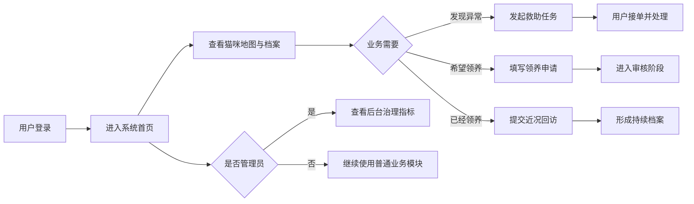

# “猫伴校园”项目需求规格说明书

## 文档控制

| 项目 | 内容 |
|---|---|
| 项目名称 | “猫伴校园”——校内猫咪救助、健康记录与可信领养平台 |
| 文档类型 | 软件需求规格说明书（项目启动阶段） |
| 文档版本 | V1.0 |
| 文档状态 | 需求基线草案 |
| 编写时点 | 项目设计与开发开始前 |
| 预期读者 | 项目组成员、课程教师、需求评审人员、测试人员 |

## 1. 引言

### 1.1 编写目的

本文档用于在项目开发开始前明确“猫伴校园”平台的建设目标、用户范围、功能边界、业务规则、非功能需求和验收条件，并作为后续页面原型、数据库设计、编码实现、软件测试及项目验收的共同依据。

文档中的“应”“必须”表示本期项目必须实现的需求；“可”“建议”表示在时间和资源允许的情况下实现的增强需求。

### 1.2 项目背景

校园内存在多只长期活动的小猫，其活动区域、健康情况、绝育与疫苗状态通常由不同学生零散记录。出现受伤、生病、走失或幼猫被困等情况时，信息主要通过群聊传播，容易出现重复上报、无人接单和处理结果无法追踪等问题。

部分校园猫会被在校生或毕业学长学姐领养。领养完成后，原有校园记录与领养后的生活情况容易中断，学校中的关注者无法持续了解猫咪状态，也缺少规范的回访记录。

因此，本项目拟建设一个面向校园猫守护场景的信息平台，将猫咪建档、区域查询、异常救助、志愿协作、领养申请和毕业后回访整合到同一系统中，形成连续、可信且可追溯的校园猫档案。

### 1.3 项目愿景

让每一只校园猫都有可识别的身份，让每一次异常上报都有回应，让每一次领养在毕业之后仍能持续追踪。

### 1.4 术语说明

| 术语 | 说明 |
|---|---|
| 校园猫 | 在校园内长期或临时活动，并被师生发现、照护或记录的猫咪 |
| 猫咪档案 | 猫咪编号、名称、别名、活动区域、健康情况和状态等信息的集合 |
| 救助任务 | 针对受伤、生病、被困等异常情况发起的协作处理事项 |
| 可信领养 | 需要提交居住条件、养猫经验和长期计划，并经过审核的领养流程 |
| 校友回访 | 猫咪被毕业生领养后，对其生活和健康情况进行的持续记录 |
| 普通用户 | 登录后使用全部普通业务模块的用户 |
| 管理员 | 拥有普通业务功能，并能访问后台管理模块的用户 |

## 2. 项目目标

### 2.1 总体目标

建设一个需要账号登录、采用前后端分离架构并使用 MySQL 保存业务数据的 Web 系统，为校园猫的发现、照护、救助、领养和回访提供统一的信息入口。

### 2.2 具体目标

1. 建立“一猫一档”的校园猫身份体系。
2. 通过校园示意地图展示猫咪常见活动区域。
3. 建立异常上报、任务展示和用户接单机制。
4. 展示志愿值班安排和物资概况，促进有序照护。
5. 通过标准化申请信息提高领养决策的可信度。
6. 保存毕业生领养后的回访信息，使猫咪档案不因毕业而中断。
7. 为管理员提供平台数据概览和治理指标。
8. 通过登录、角色和后端权限校验保护系统数据。

### 2.3 成功标准

项目验收时应至少满足以下标准：

- 用户未登录时无法进入业务页面。
- 普通用户和管理员均可访问全部普通业务模块。
- 普通用户看不到后台管理入口，且不能通过直接请求访问后台接口。
- 管理员登录后可以访问后台管理模块。
- 猫咪、救助、领养、回访和登录会话数据能够写入 MySQL，并在刷新页面后保留。
- 用户能够完成“查看猫咪—发起救助—接单”“查看待领养猫咪—提交申请”和“提交领养回访”等核心流程。
- 页面能够清晰展示中文内容，不出现乱码。

## 3. 项目范围

### 3.1 本期范围

本期系统包含以下模块：

1. 账号登录与退出。
2. 首页数据总览。
3. 校园猫地图。
4. 猫咪健康档案。
5. 异常救助协同。
6. 志愿服务信息。
7. 可信领养申请。
8. 校友领养回访。
9. 管理员后台数据概览。

### 3.2 项目边界原则

- 平台只记录健康和救助信息，不代替专业兽医诊断。
- 页面不公开猫咪敏感窝点、领养人详细住址、电话和证明材料。
- 系统用于课程项目演示，不直接承担真实校园管理责任。
- 所有业务功能均要求先登录账号。

## 4. 用户与相关方分析

### 4.1 项目相关方

| 相关方 | 主要关注点 |
|---|---|
| 在校学生 | 快速查看猫咪信息、上报异常、参与救助和申请领养 |
| 志愿者 | 查看救助任务、接单、了解值班和物资情况 |
| 毕业生领养人 | 提交猫咪毕业后的生活和健康近况 |
| 管理员 | 维护数据、了解整体运行情况、查看治理指标 |
| 课程教师 | 需求是否明确、分工是否合理、系统是否完整可运行 |
| 项目开发组 | 获得稳定、可验证且不存在明显冲突的需求基线 |

### 4.2 用户角色

系统只设置两种登录角色，不再细分志愿者、领养人、审核员等身份。

| 角色 | 权限范围 |
|---|---|
| 普通用户 `USER` | 登录、查看首页、地图、猫咪档案、救助、志愿服务、领养和回访；提交普通业务数据；接受待处理救助任务 |
| 管理员 `ADMIN` | 拥有普通用户的全部功能，并可访问后台管理模块和治理指标 |

### 4.3 权限矩阵

| 功能模块 | 未登录访客 | 普通用户 | 管理员 |
|---|:---:|:---:|:---:|
| 登录页面 | √ | — | — |
| 首页总览 | × | √ | √ |
| 校园猫地图 | × | √ | √ |
| 猫咪档案 | × | √ | √ |
| 救助协同 | × | √ | √ |
| 志愿服务 | × | √ | √ |
| 可信领养 | × | √ | √ |
| 校友回访 | × | √ | √ |
| 后台管理 | × | × | √ |

## 5. 总体业务流程

## 6. 功能需求

### 6.1 用户认证与权限

| 编号 | 需求描述 | 优先级 | 验收条件 |
|---|---|:---:|---|
| FR-AUTH-01 | 系统应提供账号和密码登录功能 | 必须 | 正确账号密码可以登录，错误信息不能登录 |
| FR-AUTH-02 | 所有业务页面必须在登录后访问 | 必须 | 未登录访问业务接口时被拒绝或跳转到登录页 |
| FR-AUTH-03 | 系统应提供退出登录功能 | 必须 | 退出后当前会话失效并回到登录页 |
| FR-AUTH-04 | 系统只设置 `USER` 和 `ADMIN` 两种角色 | 必须 | 用户数据中不存在本项目之外的业务角色 |
| FR-AUTH-05 | 普通用户不得看到后台管理入口 | 必须 | 使用普通账号登录时导航栏无后台管理菜单 |
| FR-AUTH-06 | 后台接口必须在服务端校验管理员身份 | 必须 | 普通用户直接请求后台接口时返回无权限结果 |
| FR-AUTH-07 | 管理员应能访问普通用户可用的全部模块 | 必须 | 管理员可以正常使用地图、档案、救助、领养和回访功能 |
| FR-AUTH-08 | 登录会话应设置过期时间 | 应该 | 超过有效期的令牌不能继续访问系统 |

### 6.2 首页总览

| 编号 | 需求描述 | 优先级 | 验收条件 |
|---|---|:---:|---|
| FR-HOME-01 | 首页应展示猫咪档案总数 | 必须 | 统计值与数据库记录数量一致 |
| FR-HOME-02 | 首页应展示进行中救助任务数量 | 必须 | 未完成任务可以被正确统计 |
| FR-HOME-03 | 首页应展示待处理领养申请数量 | 必须 | 未完成申请可以被正确统计 |
| FR-HOME-04 | 首页应展示正常回访数量 | 应该 | 状态为“回访正常”的记录被统计 |
| FR-HOME-05 | 首页应展示近期救助任务摘要 | 应该 | 至少可查看任务描述、位置、接单人和状态 |
| FR-HOME-06 | 首页应提供快速发起救助和查看待领养猫咪入口 | 应该 | 点击入口可到达对应操作 |

### 6.3 校园猫地图

| 编号 | 需求描述 | 优先级 | 验收条件 |
|---|---|:---:|---|
| FR-MAP-01 | 系统应在校园示意图上展示未被领养猫咪的位置标记 | 必须 | 档案中的地图坐标能够转化为页面标记 |
| FR-MAP-02 | 地图标记应显示猫咪名称 | 必须 | 用户可在地图中区分不同猫咪 |
| FR-MAP-03 | 页面应同时展示区域记录列表 | 应该 | 列表包含编号、名称、区域和状态 |
| FR-MAP-04 | 已领养猫咪默认不在校园地图中显示 | 必须 | 状态为“已领养”的猫咪不会出现在校内标记中 |

### 6.4 猫咪档案

| 编号 | 需求描述 | 优先级 | 验收条件 |
|---|---|:---:|---|
| FR-CAT-01 | 系统应展示全部校园猫档案 | 必须 | 登录用户可以查看数据库中的猫咪记录 |
| FR-CAT-02 | 每只猫咪应具有唯一档案编号 | 必须 | 新增档案后产生不重复的编号 |
| FR-CAT-03 | 档案应记录名称、别名、性别、年龄、区域、状态、健康和性格 | 必须 | 页面和数据库能够保存并重新读取这些字段 |
| FR-CAT-04 | 登录用户应能新建猫咪档案 | 必须 | 提交有效表单后数据库新增一条记录 |
| FR-CAT-05 | 系统应支持修改已有猫咪档案 | 应该 | 修改后刷新页面仍显示新内容 |
| FR-CAT-06 | 系统应允许记录已被毕业生领养的猫咪 | 必须 | 猫咪状态可设置为“已领养”，区域可填写领养去向 |
| FR-CAT-07 | 新建档案缺少状态时应使用默认待确认状态 | 应该 | 状态为空时系统自动补充默认值 |

### 6.5 救助协同

| 编号 | 需求描述 | 优先级 | 验收条件 |
|---|---|:---:|---|
| FR-RES-01 | 登录用户应能发起救助任务 | 必须 | 填写猫咪、位置、优先级和异常描述后可提交 |
| FR-RES-02 | 救助任务应支持高、中、低三个优先级 | 必须 | 页面可以选择并正确保存 `HIGH`、`MEDIUM`、`LOW` |
| FR-RES-03 | 新建救助任务应自动进入“待接单”状态 | 必须 | 新记录状态为“待接单”且接单人未指派 |
| FR-RES-04 | 登录用户应能接受处于待接单状态的任务 | 必须 | 接单后状态和接单人发生变化 |
| FR-RES-05 | 已被接单的任务不得重复接单 | 必须 | 再次接单时系统拒绝操作并提示冲突 |
| FR-RES-06 | 救助任务列表应按创建时间倒序展示 | 应该 | 最新任务优先显示 |
| FR-RES-07 | 任务列表应展示描述、猫咪、位置、优先级、状态和接单人 | 必须 | 用户不进入详情页即可了解关键信息 |

### 6.6 志愿服务

| 编号 | 需求描述 | 优先级 | 验收条件 |
|---|---|:---:|---|
| FR-VOL-01 | 系统应展示本周志愿值班安排 | 应该 | 页面可查看地点、时间和负责人 |
| FR-VOL-02 | 系统应展示主要物资库存概况 | 应该 | 页面可查看猫粮、猫砂、航空箱等物资的概况 |
| FR-VOL-03 | 页面应展示科学投喂提示 | 应该 | 用户可看到固定地点、固定时间、适量投喂及及时清理的提示 |
| FR-VOL-04 | 本期志愿服务模块可采用展示型数据 | 可选 | 不要求实现完整的排班和库存增删改查 |

### 6.7 可信领养

| 编号 | 需求描述 | 优先级 | 验收条件 |
|---|---|:---:|---|
| FR-ADO-01 | 系统应展示处于等待领养或临时寄养状态的猫咪 | 必须 | 其他状态的猫咪不出现在待领养列表中 |
| FR-ADO-02 | 登录用户应能提交领养申请 | 必须 | 选择猫咪并填写完整资料后可保存申请 |
| FR-ADO-03 | 申请信息应包含申请人、居住条件、养猫经验和长期计划 | 必须 | 缺少必填项时不能提交 |
| FR-ADO-04 | 新申请应自动进入“材料审核中”阶段 | 必须 | 提交后页面显示对应阶段 |
| FR-ADO-05 | 申请记录应关联当前登录账号 | 必须 | 数据库可以追溯申请提交人 |
| FR-ADO-06 | 普通用户只应看到自己的领养申请 | 必须 | 普通用户无法查看其他账号的申请 |
| FR-ADO-07 | 管理员应能查看全部领养申请 | 必须 | 管理员查询结果包含所有用户申请 |
| FR-ADO-08 | 页面应说明领养并非“先到先得” | 应该 | 用户能够看到关于综合条件审核的提示 |

### 6.8 校友领养回访

| 编号 | 需求描述 | 优先级 | 验收条件 |
|---|---|:---:|---|
| FR-FOL-01 | 系统应展示领养回访记录 | 必须 | 用户可以查看猫咪、领养人、城市、状态和回访内容 |
| FR-FOL-02 | 登录用户应能提交新的回访记录 | 必须 | 填写猫咪名称和近期情况后可保存 |
| FR-FOL-03 | 回访记录应关联当前登录账号 | 必须 | 新记录可以追溯录入用户 |
| FR-FOL-04 | 回访记录应支持保存本次日期和下次计划日期 | 应该 | 页面能够展示下次回访时间 |
| FR-FOL-05 | 回访内容应支持记录饮食、精神、居住和医疗近况 | 必须 | 详情字段能够保存较长文本 |
| FR-FOL-06 | 系统应允许记录毕业生身份和猫咪所在城市 | 应该 | 可保存“某届毕业生”和城市信息 |
| FR-FOL-07 | 回访列表应按回访日期倒序显示 | 应该 | 最近回访优先展示 |

### 6.9 后台管理

| 编号 | 需求描述 | 优先级 | 验收条件 |
|---|---|:---:|---|
| FR-ADM-01 | 后台管理入口只能对管理员显示 | 必须 | 普通用户导航栏中不存在该入口 |
| FR-ADM-02 | 后台管理接口只能由管理员调用 | 必须 | 普通用户直接请求时得到 HTTP 403 或等价无权限结果 |
| FR-ADM-03 | 后台应展示猫咪、救助、领养、回访和账号数量 | 必须 | 统计数据可从数据库汇总得到 |
| FR-ADM-04 | 后台应展示档案完善度、健康覆盖率、救助闭环率和回访率 | 应该 | 指标以数字和进度形式清晰展示 |
| FR-ADM-05 | 管理员离开登录状态后不得继续访问后台 | 必须 | 退出或会话过期后后台请求失败 |

## 7. 关键用例说明

### UC-01 用户登录

| 项目 | 内容 |
|---|---|
| 参与者 | 普通用户、管理员 |
| 前置条件 | 用户拥有有效账号，账号处于启用状态 |
| 触发条件 | 用户打开系统并提交账号密码 |
| 基本流程 | 1. 输入账号密码；2. 系统校验账号；3. 创建登录会话；4. 返回用户身份；5. 进入首页 |
| 异常流程 | 账号不存在、密码错误或账号停用时，系统提示“账号或密码错误”且不创建会话 |
| 后置条件 | 用户获得有效会话，系统根据角色生成可见菜单 |

### UC-02 发起并接受救助任务

| 项目 | 内容 |
|---|---|
| 参与者 | 普通用户、管理员 |
| 前置条件 | 用户已登录 |
| 触发条件 | 用户发现猫咪存在异常情况 |
| 基本流程 | 1. 选择猫咪；2. 填写位置、优先级和异常描述；3. 提交任务；4. 系统生成待接单任务；5. 某用户点击接单；6. 系统更新状态和接单人 |
| 异常流程 | 缺少必填字段时不允许提交；任务已被他人接单时拒绝重复接单 |
| 后置条件 | 救助任务及其当前责任人被持久化保存 |

### UC-03 提交领养申请

| 项目 | 内容 |
|---|---|
| 参与者 | 普通用户、管理员 |
| 前置条件 | 用户已登录，目标猫咪处于可领养状态 |
| 触发条件 | 用户点击目标猫咪的“申请领养”按钮 |
| 基本流程 | 1. 查看猫咪健康和性格；2. 填写申请人、住房、经验和长期计划；3. 提交申请；4. 系统关联当前账号；5. 申请进入材料审核阶段 |
| 异常流程 | 必填信息不完整时不允许提交 |
| 后置条件 | 申请被保存，普通用户可在“我的申请”中查看 |

### UC-04 提交毕业后回访

| 项目 | 内容 |
|---|---|
| 参与者 | 普通用户、管理员 |
| 前置条件 | 用户已登录，已掌握被领养猫咪的近期情况 |
| 触发条件 | 用户选择“提交近况” |
| 基本流程 | 1. 填写猫咪名称；2. 填写所在城市和生活近况；3. 提交；4. 系统记录回访日期、录入账号和下次回访时间 |
| 异常流程 | 猫咪名称或回访内容为空时不允许提交 |
| 后置条件 | 新回访出现在回访记录列表中 |

### UC-05 管理员查看后台

| 项目 | 内容 |
|---|---|
| 参与者 | 管理员 |
| 前置条件 | 管理员已登录且会话有效 |
| 触发条件 | 管理员点击后台管理菜单 |
| 基本流程 | 1. 前端请求后台数据；2. 后端校验管理员角色；3. 汇总业务数据；4. 展示数量和治理指标 |
| 异常流程 | 普通用户或无效会话请求时，系统拒绝访问 |
| 后置条件 | 管理员获得平台整体运行概览 |

## 8. 业务规则

| 编号 | 业务规则 |
|---|---|
| BR-01 | 所有业务模块必须登录后使用 |
| BR-02 | 系统仅设置普通用户和管理员两种角色 |
| BR-03 | 除后台管理外，管理员与普通用户看到相同的功能模块 |
| BR-04 | 猫咪档案编号在系统内必须唯一 |
| BR-05 | 已领养猫咪不再显示在校园地图中 |
| BR-06 | 只有“等待领养”和“临时寄养”状态的猫咪进入待领养列表 |
| BR-07 | 新建救助任务默认状态为“待接单”，接单人默认为“暂未指派” |
| BR-08 | 一个救助任务在同一时刻只能由一名用户成功接单 |
| BR-09 | 新领养申请默认进入“材料审核中”阶段 |
| BR-10 | 普通用户只能查看本人领养申请，管理员可查看全部申请 |
| BR-11 | 回访记录应保留猫咪名称和领养近况，不因学生毕业而中断 |
| BR-12 | 普通用户即使绕过页面，也不得成功访问管理员接口 |
| BR-13 | 猫咪敏感位置和领养人隐私不得在公开页面完整展示 |

## 9. 数据需求

### 9.1 核心数据对象

| 数据对象 | 关键数据项 | 保存要求 |
|---|---|---|
| 用户账号 | 账号、密码哈希、显示名称、角色、启用状态 | 持久化保存，账号唯一 |
| 登录会话 | 随机令牌、所属用户、过期时间 | 持久化保存，令牌唯一 |
| 猫咪档案 | 编号、名称、别名、性别、年龄、区域、状态、健康、性格、地图坐标 | 持久化保存，编号唯一 |
| 救助任务 | 猫咪、异常描述、地点、优先级、状态、接单人、创建时间 | 持久化保存 |
| 领养申请 | 猫咪、申请人、住房、经验、长期计划、审核阶段、提交账号 | 持久化保存 |
| 领养回访 | 猫咪、领养人、城市、近况、状态、回访日期、下次日期、录入账号 | 持久化保存 |

### 9.2 数据完整性要求

- 用户账号、猫咪编号和登录令牌不得重复。
- 猫咪名称、救助描述、发现位置、领养申请核心信息和回访内容不得为空。
- 领养申请与回访记录应尽可能关联提交账号。
- 删除账号时应同步处理其登录会话，避免遗留有效令牌。
- 中文数据应使用 `utf8mb4` 编码保存。

### 9.3 数据保留要求

- 页面刷新或服务重启后，已提交业务数据不得丢失。
- 退出登录应删除或使当前登录会话失效。
- 历史领养回访应持续保留，便于后续追踪。
- 演示环境可预置少量账号、猫咪、救助和回访数据。

## 10. 非功能需求

### 10.1 性能需求

| 编号 | 需求描述 | 验收标准 |
|---|---|---|
| NFR-PERF-01 | 常规页面数据应在合理时间内返回 | 本地环境正常运行时，常规接口平均响应时间不超过 2 秒 |
| NFR-PERF-02 | 系统应支持课程演示期间的并发访问 | 至少支持 20 个用户同时进行查询操作而不出现明显错误 |
| NFR-PERF-03 | 列表加载不应阻塞页面交互 | 加载期间显示明确状态，完成后恢复操作 |

### 10.2 安全需求

| 编号 | 需求描述 | 验收标准 |
|---|---|---|
| NFR-SEC-01 | 密码不得以明文形式写入数据库 | 检查数据库时只能看到不可逆密码哈希 |
| NFR-SEC-02 | 后端必须校验登录会话 | 不携带有效令牌时业务接口不可访问 |
| NFR-SEC-03 | 后端必须校验管理员角色 | 普通用户请求后台接口得到 403 或等价结果 |
| NFR-SEC-04 | 数据库密码不得硬编码提交到项目源码 | 密码通过环境变量或启动时安全输入提供 |
| NFR-SEC-05 | 接口错误不应泄露数据库密码或完整堆栈 | 普通页面只展示可理解的错误信息 |

### 10.3 易用性需求

| 编号 | 需求描述 | 验收标准 |
|---|---|---|
| NFR-USE-01 | 导航名称应简洁且符合业务含义 | 用户能够从菜单直接识别主要模块 |
| NFR-USE-02 | 表单必填项应有明确标识和校验 | 缺少必填内容时系统阻止提交并提示原因 |
| NFR-USE-03 | 成功和失败操作应提供反馈 | 新增、接单、登录失败等操作均有页面提示 |
| NFR-USE-04 | 页面应保持一致的视觉风格 | 颜色、按钮、卡片、状态标签和间距保持统一 |
| NFR-USE-05 | 系统应正确显示中文 | 页面、数据库及启动脚本不出现乱码 |

### 10.4 兼容性需求

- 前端应能在新版 Chrome、Edge 等主流桌面浏览器运行。
- 项目应能在 Windows 环境中通过 PowerShell 启动。
- PowerShell 启动脚本应使用兼容 Windows PowerShell 5.1 的 UTF-8 with BOM 编码。
- 数据库应兼容 MySQL 8.0。
- 前后端应通过 HTTP REST 接口通信，避免页面直接连接数据库。

### 10.5 可维护性需求

- 前端、后端、数据库脚本和项目文档应分目录管理。
- 接口地址、数据库地址、端口和会话有效期应支持通过配置修改。
- 业务模块应按领域划分代码，避免所有逻辑集中在单一文件中。
- 关键接口应提供基本的自动化测试。
- 数据库表、接口和需求应具有可追溯的文档说明。

### 10.6 可靠性需求

- 提交失败时不得在页面上显示“成功”。
- 重复接单等业务冲突应由后端判断，不能只依赖前端按钮状态。
- 请求参数不合法时系统应返回明确错误，不应导致服务崩溃。
- 数据库暂时不可用时系统应给出可定位的启动或连接错误。

## 11. 界面与交互需求

### 11.1 总体布局

登录后页面拟采用左侧导航栏和右侧内容区域的后台式布局。左侧固定展示系统名称、功能入口、当前账号和退出按钮；右侧根据当前模块展示统计卡片、业务列表、地图或表单。

### 11.2 页面清单

| 页面/区域 | 主要内容 |
|---|---|
| 登录页 | 项目介绍、账号输入、密码输入、登录按钮 |
| 首页 | 项目愿景、四项核心统计、待处理救助、快捷操作 |
| 猫咪地图 | 校园示意图、猫咪位置标记、区域记录 |
| 猫咪档案 | 猫咪卡片列表、新建档案表单 |
| 救助协同 | 救助任务队列、发起任务、接单操作 |
| 志愿服务 | 本周值班安排、投喂提示、物资概况 |
| 可信领养 | 待领养猫咪、申请表单、申请记录 |
| 校友回访 | 回访卡片、下次回访日期、近况提交表单 |
| 后台管理 | 业务数量、治理指标、权限说明 |

### 11.3 状态反馈

- 加载数据时应显示加载状态或禁用重复操作。
- 表单提交成功后应关闭表单并刷新相关列表。
- 登录失败、校验失败、无权限和业务冲突应展示中文提示。
- 不同业务状态应使用清晰的标签或颜色区分，但不能只依赖颜色表达含义。

### 11.4 响应式要求

本期以桌面端展示为主。页面在常见笔记本分辨率下不应出现主要内容被遮挡的情况；在较窄窗口下，卡片布局应能够换行，表单仍应可操作。

## 12. 技术与运行约束

### 12.1 计划技术架构

| 层次 | 拟采用技术 | 选择理由 |
|---|---|---|
| 前端 | Vue 3、Vite | 组件化开发，适合快速构建交互式单页应用 |
| 后端 | Spring Boot、Spring Web | 便于实现 REST API、参数校验和权限拦截 |
| 持久层 | Spring Data JPA、Hibernate | 简化实体映射和常规数据库操作 |
| 数据库 | MySQL 8.0 | 满足课程要求，支持事务、外键和中文数据 |
| 通信方式 | JSON over HTTP | 实现前后端分离，便于独立开发和测试 |

### 12.2 部署约束

- 前端和后端应作为两个独立程序启动。
- 后端默认提供 REST API 服务，前端通过配置连接后端地址。
- MySQL 数据库应先创建目标数据库，账号密码由运行环境提供。
- 项目应提供面向 Windows 的前后端启动说明或脚本。
- 所有自有源码和文档统一使用 UTF-8；PowerShell 脚本使用 UTF-8 with BOM。

## 13. 需求优先级

本项目使用 MoSCoW 方法划分需求优先级：

| 级别 | 含义 | 本项目内容 |
|---|---|---|
| Must 必须 | 缺少则项目不能验收 | 登录、两种角色、权限校验、猫咪档案、救助、领养、回访、MySQL 持久化 |
| Should 应该 | 对完整体验很重要 | 地图、首页统计、志愿信息、治理指标、下次回访日期 |
| Could 可以 | 时间允许时增强 | 更完整的筛选、审核意见、任务进度、通知提醒 |
| Won't 本期不做 | 明确排除 | 支付、AI 识别、实时定位、统一身份认证、电子合同 |

## 14. 验收测试清单

| 编号 | 验收场景 | 预期结果 |
|---|---|---|
| AT-01 | 使用正确普通账号登录 | 成功进入首页，后台管理入口不可见 |
| AT-02 | 使用正确管理员账号登录 | 成功进入首页，后台管理入口可见 |
| AT-03 | 使用错误密码登录 | 登录失败并显示中文提示 |
| AT-04 | 未登录直接请求业务接口 | 请求被拒绝 |
| AT-05 | 普通用户直接请求后台接口 | 返回 HTTP 403 或等价无权限结果 |
| AT-06 | 新建一条猫咪档案并刷新页面 | 新档案仍存在且编号唯一 |
| AT-07 | 发起救助任务 | 新任务显示为“待接单” |
| AT-08 | 接受待接单救助任务 | 状态变为“前往中”，显示当前接单人 |
| AT-09 | 两次接受同一任务 | 第二次操作被拒绝 |
| AT-10 | 为可领养猫咪提交完整申请 | 申请保存并显示“材料审核中” |
| AT-11 | 普通用户查询领养申请 | 只能看到本人提交的记录 |
| AT-12 | 管理员查询领养申请 | 能看到全部用户记录 |
| AT-13 | 提交猫咪领养近况 | 回访记录保存并显示下次回访日期 |
| AT-14 | 重启前后端后重新登录 | 已保存的业务数据仍存在 |
| AT-15 | 查看中文页面和启动脚本 | 不出现乱码或乱码导致的语法错误 |

## 15. 项目风险与应对

| 风险 | 影响 | 应对措施 |
|---|---|---|
| 需求范围持续扩大 | 无法按课程时间完成 | 以 Must 需求为验收基线，扩展功能放入后续版本 |
| 组员模块接口不一致 | 前后端联调失败 | 提前确定字段和接口文档，统一错误格式 |
| MySQL 环境或密码配置错误 | 后端无法启动 | 提供建库脚本、环境变量和启动说明 |
| 中文编码不一致 | 页面或脚本乱码 | 源码统一 UTF-8，PowerShell 脚本使用 UTF-8 with BOM |
| 只在前端隐藏后台入口 | 普通用户可能绕过页面访问 | 后端必须独立校验管理员角色 |
| 演示数据不足 | 页面效果空洞 | 准备少量覆盖不同状态的猫咪和业务数据 |
| 真实隐私信息被录入 | 产生隐私风险 | 使用模拟数据，避免公开详细住址、电话和敏感窝点 |
| 救助信息被误认为医疗结论 | 产生错误判断 | 明确平台仅记录和协作，专业问题应联系兽医 |

## 16. 需求追踪矩阵

| 项目目标 | 对应功能需求 | 主要验收用例 |
|---|---|---|
| 建立统一猫咪身份档案 | FR-CAT-01～FR-CAT-07 | AT-06 |
| 展示猫咪校园分布 | FR-MAP-01～FR-MAP-04 | 查看地图与区域列表 |
| 形成救助协同闭环 | FR-RES-01～FR-RES-07 | AT-07、AT-08、AT-09 |
| 规范可信领养申请 | FR-ADO-01～FR-ADO-08 | AT-10、AT-11、AT-12 |
| 保持毕业后领养记录连续 | FR-FOL-01～FR-FOL-07 | AT-13 |
| 实现登录和角色权限 | FR-AUTH-01～FR-AUTH-08 | AT-01～AT-05 |
| 提供管理员治理概览 | FR-ADM-01～FR-ADM-05 | AT-02、AT-05 |
| 保证数据持久保存 | 第 9 章数据需求 | AT-14 |
| 保证中文和环境兼容 | NFR-USE-05、兼容性需求 | AT-15 |

## 17. 需求确认

在进入详细设计和编码阶段前，项目组应共同确认以下内容：

- 项目名称、目标用户和使用场景无重大分歧。
- 系统只保留普通用户和管理员两种身份。
- 所有业务模块均要求登录后访问。
- 除后台管理外，两种身份可见相同业务模块。
- 项目采用前后端分离架构并使用 MySQL 数据库。
- 本期核心范围为猫咪档案、地图、救助、志愿信息、领养和回访。
- 不将在线支付、实时定位、AI 识别和真实医疗诊断纳入本期范围。
- 功能需求、非功能需求和验收标准可以作为后续设计、开发和测试依据。

需求确认后，需求变更应记录变更原因、影响模块、负责人和确认结果，避免在开发过程中出现无控制的范围扩张。

